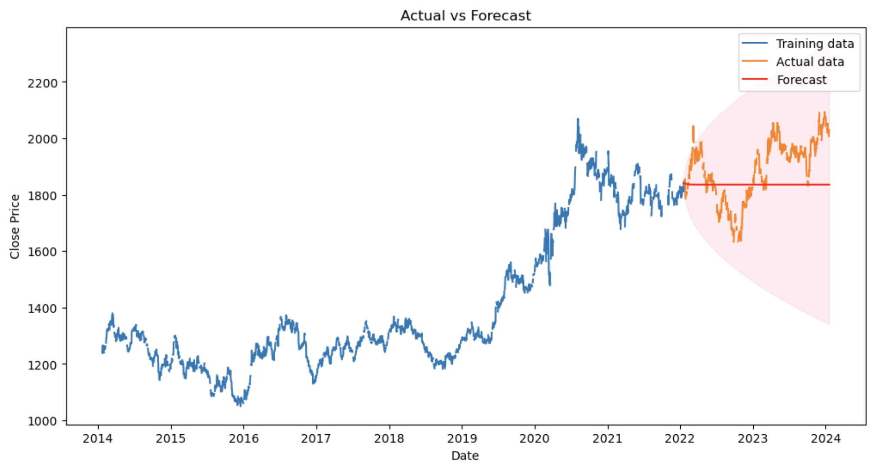
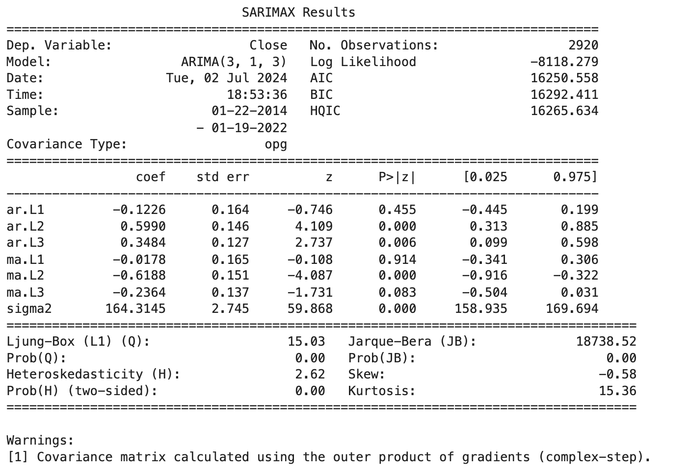

# ARMAModel
Building and Evaluating ARMA Models

Dataset used was from https://www.kaggle.com/datasets/tunguz/gold-prices

# Step by Step Guide

Step 1: Load the Data  
Step 2: Visualize the Data - It's good practice to visualize the data to get a sense of its trends and seasonality.  
Step 3: Test for Stationarity - We will use the Augmented Dickey-Fuller test to check if the series is stationary.  
Step 4: Make the Series Stationary - If the data is not stationary, we need to apply transformations such as differencing.  
Step 5: Plot ACF and PACF - This will help us determine the potential orders for the ARMA model. https://www.youtube.com/watch?v=gqryqIlvEoM  
Step 6: Build the ARMA Model - Based on the insights from the ACF and PACF plots, select appropriate p and q values.  
Step 7: Forecast and Plot - Forecast into the future and plot the results.  
Step 8: Analyze the Residuals - Check if the residuals look like white noise.  

# Key Statistics

Log Likelihood: -8118.279 - A measure of model fit; higher values indicate a better fit.  
AIC (Akaike Information Criterion): 16250.558 - Lower values indicate a better model.  
BIC (Bayesian Information Criterion): 16292.411 - Lower values indicate a better model.  
HQIC (Hannan-Quinn Information Criterion): 16265.634 - Lower values indicate a better model.  
Ljung-Box (L1) (Q): 15.03 - This is a test for autocorrelation in the residuals. The p-value (Prob(Q)) of 0.00 indicates significant autocorrelation.  
Heteroskedasticity (H): 2.62 - A test for heteroskedasticity (non-constant variance). The p-value (Prob(H)) of 0.00 indicates significant heteroskedasticity.  
Jarque-Bera (JB): 18738.52 - A test for normality of residuals. The p-value (Prob(JB)) of 0.00 indicates that the residuals are not normally distributed.  
Skew: -0.58 - Indicates the asymmetry of the residuals distribution.  
Kurtosis: 15.36 - Indicates the "tailedness" of the residuals distribution.  

# Interpretation

Significant AR and MA Terms: The model has significant AR(2), AR(3), and MA(2) terms, suggesting these terms are important for the model. The non-significant AR(1) and MA(1), MA(3) terms suggest they might not contribute significantly to the model.  
Residual Diagnostics: The Ljung-Box test indicates significant autocorrelation in the residuals, which is a concern. The heteroskedasticity test and the Jarque-Bera test suggest issues with the residual variance and normality, respectively.  
Model Fit: The AIC, BIC, and HQIC values can be used to compare this model to other models. Lower values indicate a better fit, but considering residual diagnostics is crucial.  
